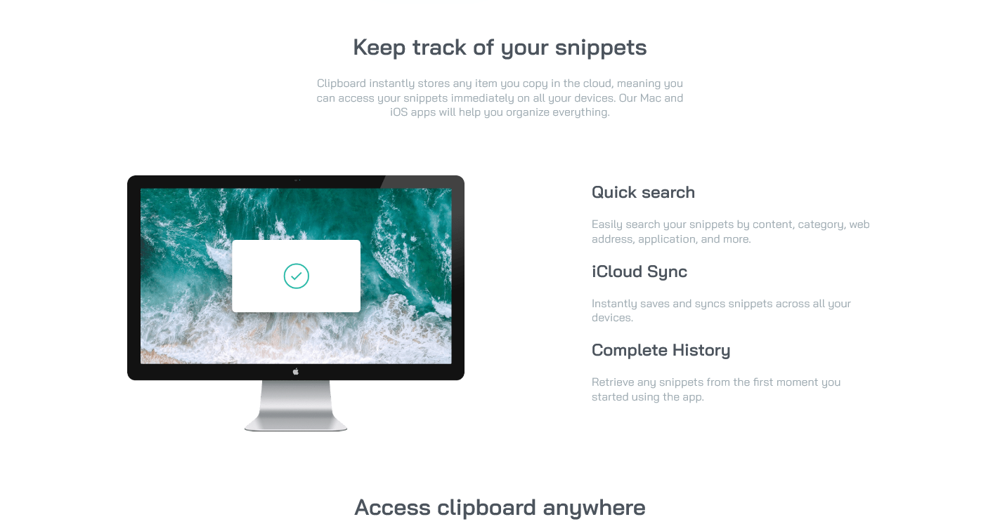

# Frontend Mentor - Clipboard landing page solution

This is a solution to the [Clipboard landing page challenge on Frontend Mentor](https://www.frontendmentor.io/challenges/clipboard-landing-page-5cc9bccd6c4c91111378ecb9). Frontend Mentor challenges help you improve your coding skills by building realistic projects. 

## Table of contents

- [Overview](#overview)
  - [The challenge](#the-challenge)
  - [Screenshot](#screenshot)
  - [Links](#links)
- [My process](#my-process)
  - [Built with](#built-with)
  - [What I learned](#what-i-learned)
  - [Continued development](#continued-development)
  - [Useful resources](#useful-resources)
- [Author](#author)
- [Acknowledgments](#acknowledgments)


## Overview

### The challenge

Users should be able to:

- View the optimal layout for the site depending on their device's screen size
- See hover states for all interactive elements on the page

### Screenshot




### Links

- Solution URL: https://github.com/ichiklaus/fementor-clipboard
- Live Site URL: https://ichiklaus.github.io/fementor-clipboard/

## My process

### Built with

- Semantic HTML5 markup
- CSS custom properties
- Flexbox


### What I learned

I developed a better understanding of flexbox by doing this project. I still struggle with the visual spacing part, but a way I learned to work with this is by drawing borders to these containers, this really helps a lot if you don't know where your spaces/margins/paddings are.


```css
.proud-of-this-css {
  color: var(); 
  background-image: url(../images/bg-header-desktop.png), linear-gradient(to bottom, rgba(255,255,255,1), rgba(255,255,255,1));
  filter: invert(54%) sepia(86%) saturate(369%) hue-rotate(121deg) brightness(96%) contrast(89%);
}
```


### Continued development

Flexbox.
CSS grid.
Mobile-first workflow.


### Useful resources

- [To change any SVG Color] https://stackoverflow.com/a/53336754 - This helped me to filter an SVG to a specific color using a color to filter converter.
- [CSS filter generator to convert from black to target hex color](https://codepen.io/sosuke/pen/Pjoqqp) - This is an amazing article which helped me finally understand XYZ. I'd recommend it to anyone still learning this concept.


## Author

- Website - Yeraldo Nicolás Moreira Valdivieso
- Frontend Mentor - [@ichiklaus] https://www.frontendmentor.io/profile/ichiklaus
- Twitter - [@ichiklaus](https://www.twitter.com/ichiklaus)


## Acknowledgments

I'd like to thank stackoverflow, freecodecamp, w3schools, and the whole internet for free learning resources. Also, special thanks to 'sosuke' from codepen.io for this solution: https://codepen.io/sosuke/pen/Pjoqqp

